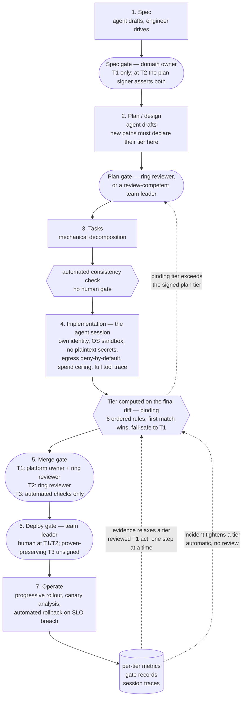

# The target Agentic SDLC

The life cycle itself: what happens at each stage, who does it, what comes out, and who
signs it off.

- **This directory adds no decisions.** Every rule here traces to a numbered decision record
  in [`reference/decisions/`](../reference/decisions/README.md). On any conflict between a
  file here and an ADR, **the ADR wins and the file here has a bug**.
- **For what to install**, read a variant sheet instead: [cloud](../variants/cloud.md) or
  [self-hosted](../variants/self-hosted.md).
- **For the order to build it in**, read the [rollout plan](../rollout/plan.md).

## What this is

An **Agentic software development life cycle**: a life cycle in which **agents execute
multi-step development work — planning, editing, running tests, opening changes — under
human review gates**, rather than a human executing every step with AI help
([ADR-0002](../reference/decisions/0002-scope-agentic-not-ai-assisted.md)). Tooling that only
speeds up a human-executed workflow is out of scope.

Concretely, "agent" here means: a Claude Code session, running under its **own machine
identity** inside an OS-level sandbox, driven by an AI solution engineer, producing artifacts
that humans sign at defined gates
([ADR-0007](../reference/decisions/0007-agent-runner-and-containment.md),
[ADR-0008](../reference/decisions/0008-agent-write-scope-and-enforcement.md)).

This is the starting posture, not the destination. The recorded end goal is a **fully
autonomous software factory and operations**
([ADR-0048](../reference/decisions/0048-end-goal-autonomous-software-factory.md)): every
human gate below is scaffolding carrying the evidence signal that would retire it, and the
per-gate exit signals are [OQ-25](../reference/open-questions.md#oq-25--gate-retirement-the-exit-signal-per-human-gate).

The life cycle is **identical in all three deployment variants**. The variants differ in what
enforces it, not in what it is — see [`variants/`](../variants/README.md).

## The honest footing

No published evidence establishes that human gates improve agent-code outcomes, and the one
measured effect is that a gate *loosens* over time. Every gating rule here is therefore an
explicit bet carrying the instrumentation that would show it wrong
([ADR-0003](../reference/decisions/0003-graduated-gating-machine-derived-tier.md)). The
intended loop is decide → run → measure → revise.

## The flow

Stages 1–3 are **per feature**. Stages 4–7 are **per change**, and run many times per
feature. That split is deliberate: the cost of the spec and plan gates does not scale with
agent output volume ([ADR-0005](../reference/decisions/0005-roles-gate-signers-and-the-reviewer-ring.md)).

## Read in this order

| # | File | What it answers |
|---|---|---|
| — | [roles.md](roles.md) | Who exists, who may sign what, and the reviewer ring |
| — | [tiers.md](tiers.md) | How a change's tier is computed, and which gates each tier gets |
| — | [templates/](templates/README.md) | The three artifacts a feature produces, the traceability chain through them, and where the blanks ship |
| — | [skills/](skills/README.md) | The four stage procedures the agent is given, and how they reach an engineer |
| — | [examples/](examples/README.md) | One feature carried through the artifacts, with the frictions left visible |
| 1 | [01-spec.md](01-spec.md) | Stating the problem and what "done" means |
| 2 | [02-plan.md](02-plan.md) | The approach, and declaring the tier of every new path |
| 3 | [03-tasks.md](03-tasks.md) | Decomposition — an artifact, not a gate |
| 4 | [04-implementation.md](04-implementation.md) | The agent session and everything that contains it |
| 5 | [05-merge.md](05-merge.md) | Computing the binding tier and taking the merge signatures |
| 6 | [06-deploy.md](06-deploy.md) | Human wherever behaviour can change; proven-preserving T3 batches ship unsigned |
| 7 | [07-operate.md](07-operate.md) | Rollout, rollback, and the measurements the whole design depends on |

Read `roles.md` and `tiers.md` first. Every stage file refers to both.

## What is deliberately not automated

Today's posture. Each item is a bet with an exit condition, not doctrine
([ADR-0048](../reference/decisions/0048-end-goal-autonomous-software-factory.md) part 4);
the per-item exit signals are
[OQ-25](../reference/open-questions.md#oq-25--gate-retirement-the-exit-signal-per-human-gate).

- **Deploy** — human wherever behaviour can change; a batch of mechanically proven
  behavior-preserving T3 changes ships unsigned
  ([ADR-0036](../reference/decisions/0036-constraint-audit-cuts.md) part 4), and lockfile
  bumps automate only at [07-operate.md](07-operate.md)'s exit condition.
- **Tier assignment by judgment** — no human rates changes; no agent classifies its own work.
  Agents may argue, not decide.
- **Per-action in-session policy evaluation** — not adopted; every source describing it is
  vendor material
  ([ADR-0008](../reference/decisions/0008-agent-write-scope-and-enforcement.md) part 4).
- **The tier map's maintenance** — the agent may never write the configuration that decides
  what merges without a human, even though it grows fastest.

## What would change this design

Standing reopen triggers, headline set — each ADR carries its own full conditions:

- Forgejo shipping an audit log reopens the self-hosted host choice.
- A non-Kubernetes deployment target reopens the self-hosted rollout answer.
- A per-seat fee on the Console path, or API-key authentication ceasing to be a supported
  mode, reopens the runner licensing.
- Ring reviewers demonstrably unable to operate Gerrit after a quarter of reviewing triggers
  the Forgejo fallback.
- Flagger's rollback semantics or licence changing, or drill evidence showing the abort path
  failing, reopens the deployment layer.
- Incident history at volume enables the learned-risk-score upgrade.

## Prerequisites before any of this runs

Blockers, not tasks — see [rollout plan](../rollout/plan.md) phase 0 for the full list with
dependencies.

1. **Platform owner and backup named** ([OQ-10](../reference/open-questions.md)).
2. **Deployment target known.**
3. **WSL2 provisioned** for every Windows-based engineer — the sandbox refuses to start
   without it, by design.
4. **Claude Console organisation** with spend limits.
5. **The code host stood up and configured** per the variant sheet.
6. **Observability stood up** before any pilot work — components chosen by
   [ADR-0015](../reference/decisions/0015-observability-backend.md); six ordered bring-up steps in
   [rollout/plan.md](../rollout/plan.md) §2. **Retention is step 1 and is not retroactive:**
   configuring it after records start arriving loses the earliest pilot data for good.
