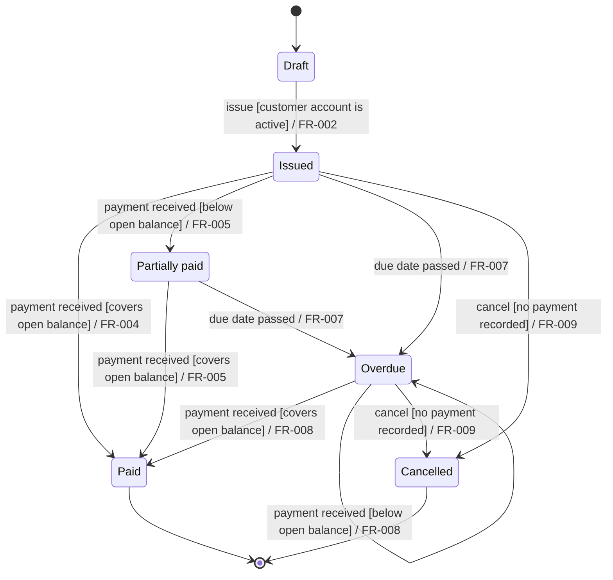

# State-model formats — the same machine, four ways

Exploration for reopening [ADR-0035](../../reference/decisions/0035-spec-state-model.md)'s
form question before it lands. One realistic machine — an invoice lifecycle, 6 states,
10 transitions, guards, one self-loop, two failure paths — written in each candidate form.
The generator and its input are in this directory; `invoice.mmd` is committed generated
output (`python statemodel_to_mermaid.py invoice.statemodel.json`, byte-identical on every
run).

**The machine, rendered** (this exact diagram appears in every option; only the committed
source differs):



---

## Option A — markdown table normative (ADR-0035 as decided)

The signed spec carries this; the diagram above is optional and must match it.

*States:* Draft, Issued, Partially paid, Overdue, Paid, Cancelled.
*Initial:* Draft. *Terminal:* Paid, Cancelled.

| From | Trigger | Guard | To | FR ids |
|---|---|---|---|---|
| Draft | issue | customer account is active | Issued | FR-002 |
| Issued | payment received | covers open balance | Paid | FR-004 |
| Issued | payment received | below open balance | Partially paid | FR-005 |
| Partially paid | payment received | covers open balance | Paid | FR-005 |
| Issued | due date passed | — | Overdue | FR-007 |
| Partially paid | due date passed | — | Overdue | FR-007 |
| Overdue | payment received | covers open balance | Paid | FR-008 |
| Overdue | payment received | below open balance | Overdue | FR-008 |
| Issued | cancel | no payment recorded | Cancelled | FR-009 |
| Overdue | cancel | no payment recorded | Cancelled | FR-009 |

- Renders as a table everywhere, including where Mermaid rendering is broken or absent.
- Guard and FR ids are dedicated columns — greppable, and the checker reads them as fields.
- The optional diagram is hand-written, so it needs the table↔diagram equivalence check:
  two hand-maintained forms, one gate keeping them honest.

## Option B — Mermaid source is the normative form (nothing else)

The signed spec carries exactly the fenced block shown at the top — the checker parses a
closed flat subset of `stateDiagram-v2` and reads trigger, guard and FR ids out of the
transition labels by convention (`trigger [guard] / FR-nnn,FR-nnn`).

- One committed form: nothing to drift, no equivalence check, fewest tokens for a
  downstream agent to read.
- The label is now load-bearing syntax inside a syntax: `payment received [below open
  balance] / FR-008` is a convention the checker owns but Mermaid does not — a typo in the
  `/` separator is a parse failure in *our* grammar that still renders fine in *theirs*.
- Where the forge cannot render (GitLab self-managed CORP case, renderer version drift),
  the signer reads the raw source above — judge for yourself how that compares to the
  table.

## Option C — JSON normative, Mermaid generated (the script in this directory)

The signed spec (or a sibling file hashed with it) carries the JSON; the diagram is
**generated, never hand-written** — CI regenerates and fails on any byte difference, the
same regenerate-and-diff gate the design already uses elsewhere.

```json
{
  "states": ["Draft", "Issued", "Partially paid", "Overdue", "Paid", "Cancelled"],
  "initial": "Draft",
  "terminal": ["Paid", "Cancelled"],
  "transitions": [
    {"from": "Draft", "trigger": "issue", "to": "Issued",
     "frs": ["FR-002"], "guard": "customer account is active"},
    {"from": "Issued", "trigger": "payment received", "to": "Paid",
     "frs": ["FR-004"], "guard": "covers open balance"},
    {"from": "Issued", "trigger": "payment received", "to": "Partially paid",
     "frs": ["FR-005"], "guard": "below open balance"},
    {"from": "Partially paid", "trigger": "payment received", "to": "Paid",
     "frs": ["FR-005"], "guard": "covers open balance"},
    {"from": "Issued", "trigger": "due date passed", "to": "Overdue",
     "frs": ["FR-007"]},
    {"from": "Partially paid", "trigger": "due date passed", "to": "Overdue",
     "frs": ["FR-007"]},
    {"from": "Overdue", "trigger": "payment received", "to": "Paid",
     "frs": ["FR-008"], "guard": "covers open balance"},
    {"from": "Overdue", "trigger": "payment received", "to": "Overdue",
     "frs": ["FR-008"], "guard": "below open balance"},
    {"from": "Issued", "trigger": "cancel", "to": "Cancelled",
     "frs": ["FR-009"], "guard": "no payment recorded"},
    {"from": "Overdue", "trigger": "cancel", "to": "Cancelled",
     "frs": ["FR-009"], "guard": "no payment recorded"}
  ]
}
```

- Fields are named, not positional — no column-alignment or separator conventions at all;
  `json` is Python stdlib, so the checker constraint holds.
- The diagram can never lie: it is derived. The drift gate becomes regenerate-and-diff,
  which the design already trusts ([ADR-0014]'s determinism discipline).
- The signer signs bytes that include JSON they will likely never read — their real
  review surface is the generated diagram plus the EARS sentences. Where rendering is
  broken, raw JSON is the fallback reading. It also adds a generator program to the
  checker's scope — one more moving part the spec stage depends on.
- Verified here: two runs produce identical bytes; a broken model (bad FR id, ambiguous
  duplicate transition, dead-end state) exits 1 naming all three defects.

## Option D — YAML normative

Same shape as C, friendlier to the eye:

```yaml
states: [Draft, Issued, Partially paid, Overdue, Paid, Cancelled]
initial: Draft
terminal: [Paid, Cancelled]
transitions:
  - {from: Draft, trigger: issue, to: Issued, frs: [FR-002], guard: customer account is active}
  - {from: Issued, trigger: payment received, to: Paid, frs: [FR-004], guard: covers open balance}
  # ... 8 more rows, identical content
```

**Blocked by a hard constraint:** Python's standard library has no YAML parser — PyYAML is
a dependency, and the checker is stdlib-only by [ADR-0014] part 7. A hand-rolled
YAML-subset parser is the kind of code nobody should trust a gate to. YAML is only live if
the stdlib-only rule is spent, which is a bigger decision than this one.

---

## What differs per reader

| Reader | A: table | B: Mermaid-only | C: JSON + generated |
|---|---|---|---|
| Drafting agent writes | table rows | diagram + label convention | named fields |
| Checker parses | pipe-split rows | our grammar inside Mermaid's | `json.load` |
| Signer reviews | table (+ optional diagram) | rendered diagram, else raw source | generated diagram, else raw JSON |
| Downstream agent reads | table (+ diagram if present) | one small block | JSON (+ diagram) |
| Drift surface | table↔diagram, gated by equivalence check | none | none (diagram derived) |
| Render-failure fallback | table — still a table | raw Mermaid source | raw JSON |

Open question this page exists to answer by looking, not arguing: which committed source
would you want to *sign*, and which would you want an agent to *edit six months later*.
